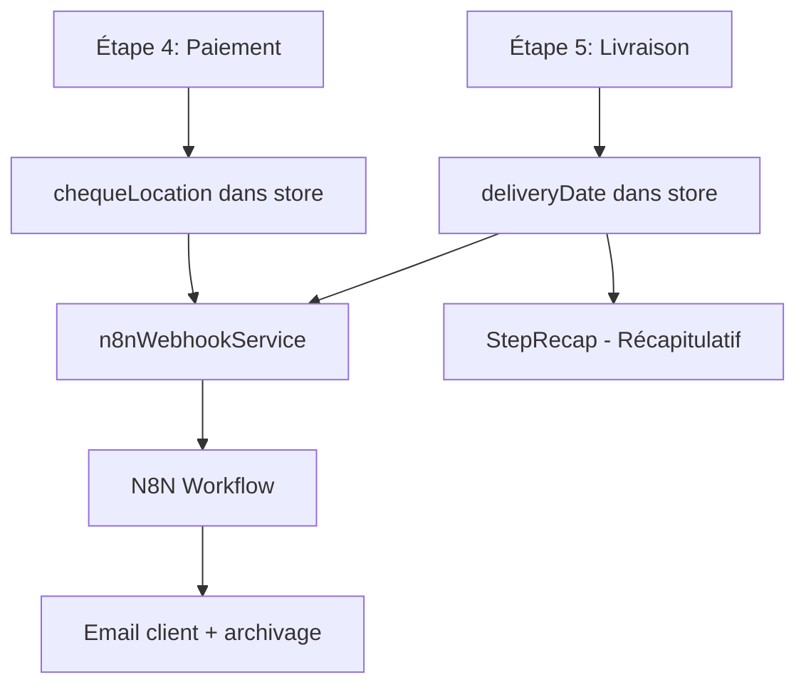

# 📋 Modifications - Date de Livraison et Lieu de Remise Chèque

## 🎯 Résumé des modifications

Cette mise à jour ajoute deux nouvelles fonctionnalités importantes à l'application de facturation MYCONFORT :

1. **📅 Date de livraison convenue** - Possibilité de définir une date précise de livraison
2. **🏢 Lieu de remise du chèque** - Choix entre "Au bureau" et "Sur place" pour les chèques à venir

---

## 🔧 Modifications techniques détaillées

### 1. **Store Zustand (`useInvoiceWizard.ts`)**

#### Interface `LivraisonData` mise à jour :
```typescript
interface LivraisonData {
  deliveryMethod?: string;
  deliveryNotes?: string;
  deliveryAddress?: string;
  deliveryDate?: string; // 🆕 Date de livraison convenue (format YYYY-MM-DD)
}
```

#### Interface `PaymentData` mise à jour :
```typescript
interface PaymentData {
  // ... autres champs
  chequeLocation?: 'bureau' | 'sur_place'; // 🆕 Lieu de remise du chèque
}
```

#### Fonctions modifiées :
- `loadInvoiceFromDraft()` - Ajout de `deliveryDate` lors du chargement
- `buildInvoicePayload()` - Ajout de `deliveryDate` dans l'export
- `updatePaiement()` - Gestion de `chequeLocation`

### 2. **Types TypeScript (`types/index.ts`)**

#### Interface `Invoice` mise à jour :
```typescript
interface Invoice {
  // ... autres champs
  deliveryDate?: string; // 🆕 Date de livraison convenue (format YYYY-MM-DD)
}
```

### 3. **Composants React**

#### `StepLivraisonNoScroll.tsx` (Étape 5 - Livraison)
- **Ajout** : Section "📅 Date de livraison convenue"
- **Design** : Onglets tactiles "Pas de date" / "Avec date"
- **Fonctionnalité** : Sélecteur de date avec validation (pas de dates passées)
- **UX iPad** : Zones tactiles larges, feedback visuel immédiat

#### `StepPaymentFixed.tsx` (Étape 4 - Paiement)
- **Ajout** : Section "Lieu de remise du chèque" sous la carte "Chèques à venir"
- **Design** : Deux boutons tactiles avec checkbox intégrée
- **Fonctionnalité** : Toggle on/off entre "Au bureau" et "Sur place"
- **Visibilité** : Conditionnelle (visible uniquement si "Chèques à venir" sélectionné)

#### `StepRecap.tsx` (Étape 7 - Récapitulatif)
- **Ajout** : Affichage de la date prévue dans la section livraison
- **Format** : Date française (DD/MM/YYYY)
- **Condition** : Affichage uniquement si une date est définie

### 4. **Service N8N (`n8nWebhookService.ts`)**

#### Payload webhook enrichi :
```typescript
const webhookPayload = {
  // ... autres champs
  // 🆕 NOUVEAUX CHAMPS LIVRAISON
  methode_livraison: invoice.deliveryMethod || '',
  date_livraison: invoice.deliveryDate || '',
  notes_livraison: invoice.deliveryNotes || '',
  
  // 🔍 DEBUG LIVRAISON
  debug_delivery_method: invoice.deliveryMethod || 'VIDE',
  debug_delivery_date: invoice.deliveryDate || 'VIDE',
  debug_delivery_notes: invoice.deliveryNotes || 'VIDE',
}
```

---

## 📱 Expérience utilisateur (UX)

### **Étape 5 - Livraison**
1. **Section "Date de livraison convenue"** avec :
   - Onglet "Pas de date" (gauche) - Masque le sélecteur
   - Onglet "Avec date" (droite) - Affiche le sélecteur
   - Sélecteur de date avec validation automatique

### **Étape 4 - Paiement**
1. **Sélection "Chèques à venir"** → Carte orange active
2. **Apparition automatique** de la section "Lieu de remise du chèque"
3. **Deux options tactiles** :
   - ☑️ "Au bureau" (gauche)
   - ☑️ "Sur place" (droite)
4. **Feedback visuel** : Bordure orange + fond blanc quand sélectionné

### **Étape 7 - Récapitulatif**
1. **Section livraison enrichie** :
   ```
   Livraison : Colissimo 48 heures
   Date prévue : 15/01/2025
   ```

---

## 📧 Intégration emails

### **Email client**
- **Section "📅 Informations de livraison"** avec :
  - Date prévue formatée en français
  - Mode de livraison
  - Affichage conditionnel

### **Email archivage**
- **Section "🚚 RÉCAPITULATIF TRANSPORT"** avec :
  - **Ligne rouge** "Date de livraison impérative" repositionnée
  - Informations de livraison détaillées
  - Design cohérent avec le thème MYCONFORT

---

## 🔄 Flux de données



---

## 🚀 Déploiement

### **Git**
```bash
git add .
git commit -m "feat: Ajout date de livraison et lieu de remise chèque"
git push origin main
```

### **Netlify**
```bash
npm run build:netlify
netlify deploy --prod --dir=dist
```

### **URL de déploiement**
- **Production** : https://myconfortfactures.netlify.app
- **Commit** : `cde5483`

---

## 📋 Code N8N à intégrer

Le code N8N a été mis à jour pour inclure les informations de livraison dans les emails. Voir le code complet fourni dans la conversation pour le node `Code6`.

### **Modifications N8N** :
1. **Email client** : Section livraison avec date et mode
2. **Email archivage** : Repositionnement de la ligne rouge "Date de livraison impérative"
3. **Design cohérent** : Couleurs MYCONFORT (#477A0C, #F2EFE2, etc.)

---

## ✅ Tests et validation

### **Tests fonctionnels**
- [x] Sélection de date dans l'étape 5
- [x] Onglets tactiles "Pas de date" / "Avec date"
- [x] Cases à cocher "Au bureau" / "Sur place" dans l'étape 4
- [x] Affichage conditionnel des sections
- [x] Persistance dans le store Zustand
- [x] Affichage dans le récapitulatif (étape 7)
- [x] Intégration dans le payload N8N

### **Tests UX iPad**
- [x] Zones tactiles >= 44px
- [x] Feedback visuel immédiat
- [x] Transitions fluides < 150ms
- [x] Design responsive paysage

---

## 🔧 Maintenance

### **Fichiers modifiés**
- `src/store/useInvoiceWizard.ts`
- `src/types/index.ts`
- `src/ipad/steps/StepLivraisonNoScroll.tsx`
- `src/ipad/steps/StepPaymentFixed.tsx`
- `src/ipad/steps/StepRecap.tsx`
- `src/services/n8nWebhookService.ts`

### **Nouvelles dépendances**
- Aucune nouvelle dépendance ajoutée

### **Compatibilité**
- ✅ Compatible avec l'existant
- ✅ Pas de breaking changes
- ✅ Rétrocompatibilité assurée

---

## 📞 Support

Pour toute question ou problème lié à ces modifications :
- **Email** : htconfort@gmail.com
- **Commit** : `cde5483`
- **Date** : 2025-10-09

---

*Modifications réalisées avec succès et déployées en production sur Netlify.*
